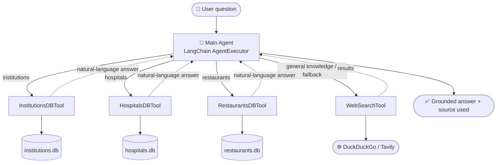

<!--
  ┌─────────────────────────────────────────────────────────────────────┐
  │  BEFORE PUBLISHING: replace every "OWNER/REPO" below with your own    │
  │  GitHub path (e.g. boraqstore7/multi-tool-ai-agent-bangladesh).       │
  └─────────────────────────────────────────────────────────────────────┘
-->

<div align="center">

# 🇧🇩 Multi-Tool AI Agent for Bangladesh

### An LLM agent that answers data questions from live databases — and searches the web for everything else.

*Ask **"How many hospitals are in Dhaka?"** → it queries a database.*
*Ask **"What is the role of DGHS?"** → it searches the web.*
*One **LangChain** agent decides which tool to use — automatically.*

<br/>

[](https://www.python.org/)
[](https://python.langchain.com/)
[-4285F4?logo=googlegemini&logoColor=white)](https://aistudio.google.com/)
[](https://streamlit.io/)
[](../../actions)
[](LICENSE)
[](../../pulls)

**`86,490` records · `3` SQLite databases · `4` tools · `1` smart router · `$0` to run**

</div>

---

## 🎥 Demo

<!--
  ▶️  HOW TO ADD YOUR SCREEN RECORDING (no video hosting needed):
      1. Open a new GitHub Issue in this repo (Issues → New issue).
      2. Drag & drop your .mp4 / .mov screen recording into the comment box.
         Wait for the upload — GitHub turns it into a link like:
            https://github.com/user-attachments/assets/1a2b3c4d-....
      3. Copy that link, paste it on the line marked "PASTE VIDEO LINK HERE"
         below (on its own line — GitHub auto-embeds a player), and delete
         this comment block. You can close the issue afterwards.
-->

> 📽️ **Full walkthrough video coming soon.** _(A screen recording of the agent answering database + web questions will be embedded here.)_

<!-- ┌──────────────── PASTE VIDEO LINK HERE (on its own line) ────────────────┐ -->

<!-- └─────────────────────────────────────────────────────────────────────────┘ -->

|  | Try it yourself |
|---|---|
| 🌐 **Live app** | _add your Streamlit Community Cloud URL here_ |
| 💻 **Run the web UI** | `streamlit run app.py` |
| ⌨️ **Run in terminal** | `python -m src.cli` |
| 📓 **Open in Colab** | [`notebooks/demo.ipynb`](notebooks/demo.ipynb) |

---

## 🧭 Overview

**Multi-Tool AI Agent for Bangladesh** is an intelligent question-answering assistant that unifies **structured data** and **live web search** behind a single natural-language interface.

The heart of the project is a **LangChain tool-calling agent** that behaves like a smart router. It has four tools and decides — on its own — which one fits your question:

- If you ask about **institutions, hospitals, or restaurants** → it writes SQL and queries a local database.
- If you ask for **general knowledge** (definitions, policies, the role of an organization) → it searches the web.
- If the database **can't** answer (e.g. hospital bed counts, which aren't in the data) → it **falls back to web search** instead of guessing.

Three real Bangladesh datasets are converted into clean, typed SQLite databases and exposed as dedicated tools, so answers are grounded in actual records — not hallucinated.

---

## ✨ Features

- 🧠 **Smart tool routing** — a single LangChain `AgentExecutor` picks the right tool per question, with no hard-coded `if/else`.
- 🗣️ **Natural language → SQL → natural language** — each database tool translates your question to SQL, runs it, and phrases the result back in plain English.
- 🔀 **Graceful fallback** — when the data can't answer, the agent routes to web search rather than making something up.
- 💸 **Runs for free** — defaults to **Google Gemini** (free tier) + **DuckDuckGo** (no key). Swap to Groq or OpenAI with a single env var.
- 🛡️ **Safe by design** — databases open **read-only**; every generated query is validated to be `SELECT`-only before it runs.
- 🎨 **Two interfaces** — a polished **Streamlit** chat app *and* a terminal **CLI**.
- ✅ **Engineered like a product** — pytest suite, GitHub Actions CI, Dockerfile, Colab notebook, and typed, documented code.

---

## 🏗️ Architecture



### How a database tool works

```
Your question
     │
     ▼
1. LLM writes SQL   ──►  2. Safety guard (SELECT-only, read-only)
                                     │
                                     ▼
                            3. Execute on SQLite
                                     │
                                     ▼
4. LLM turns the rows into a natural-language answer  ──►  🗣️
```

---

## 🗂️ Datasets

Sourced from HuggingFace and converted into typed SQLite databases by [`src/data/build_databases.py`](src/data/build_databases.py):

| Database | Table | Records | Source | Example columns |
|---|---|--:|---|---|
| `institutions.db` | `institutions` | **34,901** | [Institutional-Information-of-Bangladesh](https://huggingface.co/datasets/Mahadih534/Institutional-Information-of-Bangladesh) | `name`, `type`, `division`, `district`, `management_type`, `education_level` |
| `hospitals.db` | `hospitals` | **38,886** | [all-bangladeshi-hospitals](https://huggingface.co/datasets/Mahadih534/all-bangladeshi-hospitals) | `name`, `agency`, `type`, `division`, `district`, `is_private` |
| `restaurants.db` | `restaurants` | **12,703** | [Bangladeshi-Restaurant-Data](https://huggingface.co/datasets/Mahadih534/Bangladeshi-Restaurant-Data) | `name`, `rating`, `number_of_reviews`, `address`, `latitude`, `longitude` |

Raw column names are cleaned to meaningful `snake_case` and stored with correct SQLite types (`TEXT` / `INTEGER` / `REAL`).

---

## 💬 Example queries

| Question | Tool used | What you get |
|---|---|---|
| "How many hospitals are in Dhaka district?" | `HospitalsDBTool` | A count (e.g. **2,919**) |
| "List 10 institutions in Rajshahi division." | `InstitutionsDBTool` | A list of institution names |
| "Which restaurants have the highest ratings?" | `RestaurantsDBTool` | Names + ratings |
| "How many government institutions are there?" | `InstitutionsDBTool` | A count |
| "What is the healthcare policy of Bangladesh?" | `WebSearchTool` | A web-sourced summary |
| "How many beds does Dhaka Medical College have?" | `WebSearchTool` *(fallback)* | Not in the dataset → answered from the web |

---

## 🚀 Quickstart

```bash
# 1. Install
pip install -r requirements.txt

# 2. Configure — copy the template and add ONE free key
cp .env.example .env
#   Google Gemini (free):  https://aistudio.google.com/apikey   → GOOGLE_API_KEY
#   ...or Groq (free):     https://console.groq.com/keys        → GROQ_API_KEY (set LLM_PROVIDER=groq)

# 3. Build the SQLite databases from HuggingFace (one-time, ~30s)
python -m src.data.build_databases

# 4a. Chat in the browser
streamlit run app.py
# 4b. ...or in the terminal
python -m src.cli
```

> 💡 **Web search needs no key at all** (DuckDuckGo). Only the LLM needs a free key. The `data/*.db` files are committed, so the app runs immediately after cloning.

---

## 🔧 Configuration

Everything is driven by `.env` (see [`.env.example`](.env.example)):

| Variable | Purpose | Default |
|---|---|---|
| `LLM_PROVIDER` | `google` · `groq` · `openai` | `google` |
| `GOOGLE_API_KEY` | Free Gemini key — [get one](https://aistudio.google.com/apikey) | — |
| `GROQ_API_KEY` | Free Groq key — [get one](https://console.groq.com/keys) | — |
| `TAVILY_API_KEY` | *Optional* — upgrades web search from DuckDuckGo to Tavily | — |

Switching provider is a one-line change — the [`get_llm()`](src/config.py) factory keeps the rest of the code provider-agnostic.

---

## 🧱 Project structure

```
├── app.py                        # Streamlit chat UI (deploy target)
├── src/
│   ├── config.py                 # paths, DB registry, get_llm() provider factory
│   ├── data/build_databases.py   # HuggingFace datasets → typed SQLite
│   ├── tools/
│   │   ├── db_tool.py            # text-to-SQL tool factory (reused ×3)
│   │   └── web_search.py         # DuckDuckGo (default) / Tavily
│   ├── agent.py                  # main tool-calling AgentExecutor
│   └── cli.py                    # terminal REPL
├── data/                         # generated *.db files (committed for zero-setup)
├── tests/                        # pytest suite
├── notebooks/demo.ipynb          # Colab demo
├── .github/workflows/ci.yml      # lint + tests on every push
├── Dockerfile                    # optional containerized deploy
└── requirements.txt
```

---

## 🧪 Tests & CI

```bash
ruff check .     # lint
pytest -q        # unit tests
```

Continuous integration runs lint + tests on every push ([`.github/workflows/ci.yml`](.github/workflows/ci.yml)). The suite uses the committed databases and a fake LLM, so **CI needs no API keys and no network** — it stays green and free.

Covered: database schema & row counts, the SQL safety guard (blocks `DELETE`/`DROP`/etc.), SQL cleaning, tool construction, and web-tool wiring.

---

## 🧠 Tech stack

**Language:** Python 3.11+
**Agent framework:** LangChain (tool-calling `AgentExecutor`, `create_sql_query_chain`)
**LLM:** Google Gemini *(free)* — pluggable with Groq / OpenAI
**Data:** HuggingFace `datasets` + `pandas` → SQLite (via SQLAlchemy)
**Search:** DuckDuckGo *(keyless)* / Tavily *(optional)*
**UI:** Streamlit + a CLI
**Quality:** pytest · ruff · GitHub Actions · Docker

---

## ☁️ Deploy (free)

**Streamlit Community Cloud**

1. Push this repo to GitHub.
2. [share.streamlit.io](https://share.streamlit.io) → **New app** → select the repo → main file `app.py`.
3. Under **Settings → Secrets**, add `GOOGLE_API_KEY = "..."`.
4. Deploy — the committed `data/*.db` files mean it works instantly. Paste the URL into the **Demo** section above.

**Docker** *(optional)*

```bash
docker build -t bd-agent .
docker run -p 8501:8501 --env-file .env bd-agent
```

---

## 🛡️ Safety & design notes

- **Read-only databases** — connections are opened with SQLite `mode=ro`; a stray write raises instead of mutating data.
- **SELECT-only guard** — generated SQL is validated (and any `INSERT/UPDATE/DELETE/DROP/…` is blocked) before execution.
- **Grounded answers** — the agent responds only from tool output and names the source it used.
- **Honest fallback** — when data is missing, it searches the web rather than fabricating a number.

---

## 🗺️ Roadmap

- [ ] Conversation memory (multi-turn follow-ups)
- [ ] Map view for restaurants/hospitals (lat/long already in the data)
- [ ] Result caching to reduce LLM calls
- [ ] Bengali-language query support

---

## 🙌 Acknowledgements

Datasets by [**Mahadih534**](https://huggingface.co/Mahadih534) on HuggingFace. Built with [LangChain](https://python.langchain.com/), [Google Gemini](https://aistudio.google.com/), and [Streamlit](https://streamlit.io/).

## 📄 License

Released under the [MIT License](LICENSE).

<div align="center">

⭐ **If you find this useful, consider starring the repo!**

</div>
