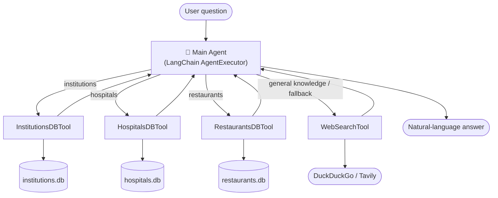

<div align="center">

# 🇧🇩 Multi-Tool AI Agent for Bangladesh

**An LLM agent that answers data questions from three Bangladesh datasets — and falls back to live web search for everything else.**

[](https://www.python.org/)
[](https://python.langchain.com/)
[](https://streamlit.io/)
[](LICENSE)
[](../../actions)

</div>

> Ask *"How many hospitals are in Dhaka?"* and it queries a SQLite database.
> Ask *"What is the role of DGHS in Bangladesh?"* and it searches the web.
> A single **LangChain agent** decides which tool to use — automatically.

---

## ✨ Highlights

- **4 tools, 1 router.** Three database tools (institutions, hospitals, restaurants) + a web-search tool, orchestrated by a LangChain tool-calling `AgentExecutor`.
- **Natural language → SQL → natural language.** Each DB tool converts your question to SQL, runs it, and phrases the result back in plain English.
- **Runs for free.** Default LLM is **Google Gemini** (free tier); web search is **DuckDuckGo** (no key). Swap in Groq / OpenAI / Claude with one env var.
- **Safe by design.** DB connections are opened **read-only** and every generated query is guard-checked to be a `SELECT`.
- **Graceful fallback.** When the data can't answer (e.g. hospital *bed counts* aren't in the dataset), the agent routes to web search instead of guessing.
- **Production polish.** Streamlit chat UI + CLI, pytest suite, GitHub Actions CI, Docker, and a Colab demo.

## 🎬 Demo

| Interface | |
|---|---|
| 🌐 **Live app** | _add your Streamlit Community Cloud URL here_ |
| 💻 **Streamlit** | `streamlit run app.py` |
| ⌨️ **CLI** | `python -m src.cli` |
| 📓 **Colab** | `notebooks/demo.ipynb` |

## 🏗️ Architecture



Each DB tool runs a **text-to-SQL pipeline**: `question → SQL (LLM) → safety check → read-only execute → answer (LLM)`.

## 🗂️ Datasets

Sourced from HuggingFace and converted to typed SQLite databases by `src/data/build_databases.py`:

| Database | Table | Source | Key columns |
|---|---|---|---|
| `institutions.db` | `institutions` | [Institutional-Information-of-Bangladesh](https://huggingface.co/datasets/Mahadih534/Institutional-Information-of-Bangladesh) | `name`, `type`, `division`, `district`, `management_type`, `education_level` |
| `hospitals.db` | `hospitals` | [all-bangladeshi-hospitals](https://huggingface.co/datasets/Mahadih534/all-bangladeshi-hospitals) | `name`, `agency`, `type`, `division`, `district`, `is_private` |
| `restaurants.db` | `restaurants` | [Bangladeshi-Restaurant-Data](https://huggingface.co/datasets/Mahadih534/Bangladeshi-Restaurant-Data) | `name`, `rating`, `number_of_reviews`, `address`, `latitude`, `longitude` |

## 🚀 Quickstart

```bash
# 1. Install
pip install -r requirements.txt

# 2. Configure (copy the template and add a FREE Gemini key)
cp .env.example .env
#   -> get a free key at https://aistudio.google.com/apikey and set GOOGLE_API_KEY

# 3. Build the SQLite databases from HuggingFace (one-time)
python -m src.data.build_databases

# 4a. Chat in the browser
streamlit run app.py
# 4b. ...or in the terminal
python -m src.cli
```

No API keys at all? Web search still works via DuckDuckGo; only the LLM needs a (free) key.

## 💬 Example queries

| Query | Tool used | What you get |
|---|---|---|
| "List top 10 institutions in Rajshahi division." | `InstitutionsDBTool` | A list of institution names |
| "How many hospitals are in Dhaka district?" | `HospitalsDBTool` | A count |
| "Which restaurants have the highest ratings?" | `RestaurantsDBTool` | Names + ratings |
| "What is the healthcare policy of Bangladesh?" | `WebSearchTool` | Web-sourced summary |
| "How many government institutions are there?" | `InstitutionsDBTool` | A count |
| "How many beds does Dhaka Medical College have?" | `WebSearchTool` *(fallback)* | Not in the dataset → answered from the web |

## 🔧 Configuration

Everything is driven by `.env` (see `.env.example`):

| Variable | Purpose | Default |
|---|---|---|
| `LLM_PROVIDER` | `google` \| `groq` \| `openai` \| `anthropic` | `google` |
| `GOOGLE_API_KEY` | Free Gemini key ([get one](https://aistudio.google.com/apikey)) | — |
| `GROQ_API_KEY` | Free Groq key ([get one](https://console.groq.com/keys)) | — |
| `TAVILY_API_KEY` | Optional — upgrades web search from DuckDuckGo to Tavily | — |

## 🧱 Project structure

```
├── app.py                      # Streamlit chat UI (deploy target)
├── src/
│   ├── config.py               # paths, DB registry, get_llm() provider factory
│   ├── data/build_databases.py # HuggingFace datasets -> typed SQLite
│   ├── tools/
│   │   ├── db_tool.py          # text-to-SQL tool factory (x3 databases)
│   │   └── web_search.py       # DuckDuckGo (default) / Tavily
│   ├── agent.py                # main tool-calling AgentExecutor
│   └── cli.py                  # terminal REPL
├── data/                       # generated *.db files
├── tests/                      # pytest suite
└── notebooks/demo.ipynb        # Colab demo
```

## 🧪 Tests & CI

```bash
ruff check .
pytest -q
```

GitHub Actions runs lint + tests on every push (`.github/workflows/ci.yml`). Tests use the committed databases and a fake LLM, so **CI needs no API keys and no network**.

## ☁️ Deploy (free)

**Streamlit Community Cloud:** push to GitHub → "New app" → point at `app.py` → add `GOOGLE_API_KEY` under *Secrets*. The committed `data/*.db` files mean the app runs immediately.

**Docker:** `docker build -t bd-agent . && docker run -p 8501:8501 --env-file .env bd-agent`

## 🛡️ Safety notes

- Databases are opened **read-only** (`mode=ro`); generated SQL is validated to be `SELECT`-only before execution.
- The agent answers strictly from tool outputs and names the source it used.

## 📄 License

[MIT](LICENSE)
